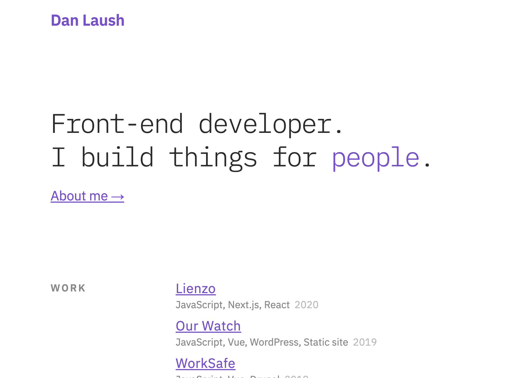
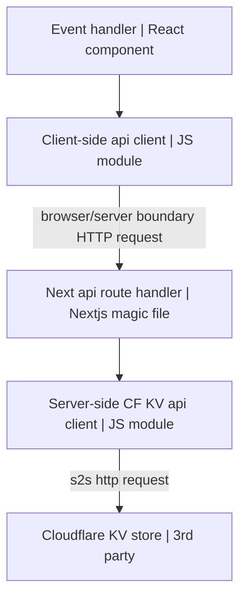
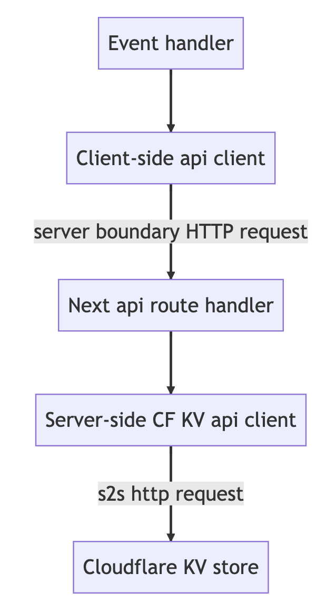

This is a [Next.js](https://nextjs.org/) project bootstrapped with [`create-next-app`](https://github.com/vercel/next.js/tree/canary/packages/create-next-app).

---



## Getting Started

First, run the development server:

```bash
npm run dev
# or
yarn dev
```

Open [http://localhost:3000](http://localhost:3000) with your browser to see the result.

## Deployment

This project is deployed with Vercel. When code is merged into `main`, a webhook on Vercel deploys the change.

## Adding a Table of Contents to a blog post

1. Import `components/table-of-contents` into the `mdx` file. Do not render it.
  - This import statement makes it available to the MDXProvider scope.
2. In `lib/customizeTOC`, add the text of the first heading in the blog post to the headings constant.
  - The only way I could find to programmatically toggle the ToC per page was this hook provided by `rehype-toc`, at which point it only has the tree of the current page available.

## RSS

https://stackoverflow.com/a/64385197
https://dev.to/kendalmintcode/create-a-next-js-rss-feed-for-your-static-website-210p

## Sound project

Journey of an interaction



